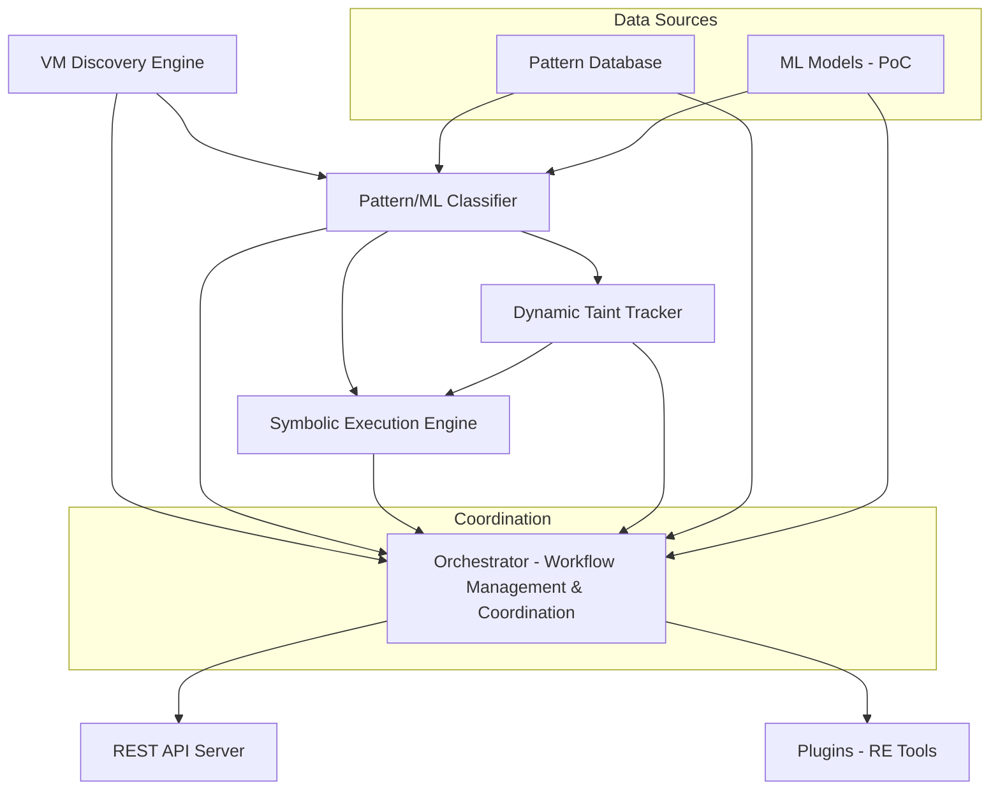

# VMDragonSlayer

**Advanced Virtual Machine Detection and Analysis Framework**

VMDragonSlayer is a comprehensive framework for analyzing binaries protected by Virtual Machine (VM) based protectors such as VMProtect 2.x/3.x, Themida, and custom malware VMs. The framework combines multiple analysis engines including Dynamic Taint Tracking (DTT), Symbolic Execution (SE), Pattern Classification, and Machine Learning to automate the reverse engineering process.

> **Goal**: Transform complex protected binary analysis from weeks/months of manual work into structured, automated analysis with explainable results.

## Key Features

- **Multi-Engine Analysis**: Combines static, dynamic, and hybrid analysis techniques
- **VM Detection**: Automated detection of commercial and custom VM protectors  
- **Plugin Ecosystem**: Integrations with Ghidra, IDA Pro, and Binary Ninja
- **Machine Learning**: Proof-of-concept ML models for pattern classification
- **Extensible Architecture**: Modular design for custom analysis workflows
- **Research Framework**: Built for malware research and reverse engineering education

---
## Core Capabilities
| Domain | Engine / Module | Highlights |
|--------|-----------------|-----------|
| VM Discovery | `analysis.vm_discovery` | Dispatcher & handler table identification, nested VM heuristics |
| Pattern Analysis | `analysis.pattern_analysis` | Rule-based + similarity + ML (hybrid auto-selection) |
| Taint Tracking | `analysis.taint_tracking` | Intel Pin–driven byte-level taint, handler discovery, flow confidence |
| Symbolic Execution | `analysis.symbolic_execution.executor` | PathPrioritizer ML-weighted exploration, constraint & state tracking |
| Hybrid Orchestration | (Python core) | Sequential / parallel / adaptive workflows (Ghidra report indicates implemented) |
| Synthetic Data | `data/training/synthetic_sample_generator.py` | Obfuscation mutation, multi-architecture sample generation |
| Pattern DB | `data/patterns/` | JSON + enhanced DB + SQLite-backed runtime patterns |
| Ghidra Plugin | `plugins/ghidra/` | In-progress UI integration (several templates missing) |
| Schemas / Validation | `data/schemas/` | JSON schema–validated analysis output & pattern formats |

---
## Architecture Overview

VMDragonSlayer uses a modular architecture where multiple analysis engines work together:



### Core Analysis Engines

#### 1. **VM Discovery Engine** (`dragonslayer.analysis.vm_discovery`)
- **Purpose**: Detect and classify VM-based protection schemes
- **Techniques**: Dispatcher loop detection, handler table analysis, control flow heuristics
- **Targets**: VMProtect, Themida, custom malware VMs, nested protection

#### 2. **Dynamic Taint Tracking** (`dragonslayer.analysis.taint_tracking`)
- **Purpose**: Track data flow through VM execution to identify critical paths
- **Implementation**: Intel Pin-based instrumentation with byte-level precision
- **Features**: Shadow memory, anti-analysis evasion, automated handler discovery

#### 3. **Pattern Analysis** (`dragonslayer.analysis.pattern_analysis`)
- **Purpose**: Classify and categorize VM patterns and behaviors
- **Methods**: Rule-based matching, similarity analysis, ML classification
- **Database**: Extensible pattern database with JSON schemas

#### 4. **Symbolic Execution** (`dragonslayer.analysis.symbolic_execution`)
- **Purpose**: Explore VM execution paths symbolically
- **Features**: Constraint solving, path prioritization, state merging
- **Integration**: Uses taint analysis results to seed exploration

#### 5. **Machine Learning Pipeline** (`dragonslayer.ml`)
- **Purpose**: Automated classification and analysis assistance
- **Models**: Basic proof-of-concept models for research and education
- **Components**: Feature extraction, model training, ensemble prediction

## Repository Structure

```
VMDragonSlayer/
├── dragonslayer/                    # Main Python package
│   ├── analysis/                   # Analysis engines
│   │   ├── vm_discovery/          # VM detection and classification
│   │   ├── pattern_analysis/      # Pattern matching and ML classification
│   │   ├── symbolic_execution/    # Symbolic execution engine
│   │   ├── taint_tracking/        # Dynamic taint analysis
│   │   └── anti_evasion/          # Anti-analysis countermeasures
│   ├── api/                       # REST API server and client
│   ├── core/                      # Core framework components
│   ├── ml/                        # Machine learning pipeline
│   ├── analytics/                 # Analysis reporting and metrics
│   ├── enterprise/                # Enterprise features
│   ├── gpu/                       # GPU acceleration support
│   ├── ui/                        # User interface components
│   ├── utils/                     # Utility functions
│   └── workflows/                 # Analysis workflow management
├── data/                          # Configuration and data files
│   ├── patterns/                  # Pattern database
│   ├── models/                    # ML models and metadata
│   │   ├── pretrained/           # Pre-trained models (PoC)
│   │   └── metadata/             # Model metadata and schemas
│   ├── samples/                   # Sample files and registries
│   ├── schemas/                   # JSON schemas for validation
│   └── training/                  # Training configurations
├── plugins/                       # Reverse engineering tool plugins
│   ├── ghidra/                   # Ghidra plugin (Java/Gradle)
│   ├── idapro/                   # IDA Pro plugin (Python)
│   └── binaryninja/              # Binary Ninja plugin (Python)
├── tests/                         # Test suite
├── docs/                          # Documentation
└── LICENSE                        # GPL v3 License
```

## Plugin Ecosystem

VMDragonSlayer integrates with major reverse engineering tools:

### Ghidra Plugin
- **Language**: Java with Gradle build system
- **Features**: VM analysis UI, pattern visualization, automated analysis workflows
- **Status**: Framework implemented, UI components in development

### IDA Pro Plugin  
- **Language**: Python
- **Features**: Seamless integration with IDA's analysis engine
- **Status**: Core functionality available

### Binary Ninja Plugin
- **Language**: Python
- **Features**: Native Binary Ninja API integration
- **Status**: Basic integration implemented

## Machine Learning Components

**Note**: The included ML models are basic proof-of-concept implementations designed for research and educational purposes.

---
## Repository Structure

```
VMDragonSlayer/
├── dragonslayer/               # Core framework
│   ├── analysis/              # Analysis engines
│   │   ├── vm_discovery/      # VM detection heuristics
│   │   ├── taint_tracking/    # Dynamic taint analysis
│   │   ├── pattern_analysis/  # Pattern recognition
│   │   ├── symbolic_execution/# Symbolic analysis
│   │   └── anti_evasion/      # Environment normalization
│   ├── ml/                    # Machine learning components
│   ├── core/                  # Framework core
│   ├── api/                   # REST API interface
│   ├── ui/                    # Dashboard and visualization
│   ├── gpu/                   # GPU acceleration (experimental)
│   └── workflows/             # Analysis orchestration
├── plugins/                   # Disassembler integrations
│   ├── ghidra/               # Ghidra plugin
│   ├── idapro/               # IDA Pro plugin
│   └── binaryninja/          # Binary Ninja plugin
├── data/                     # Configuration and models
│   ├── models/               # Pre-trained ML models
│   ├── patterns/             # Pattern databases
│   ├── samples/              # Sample configurations
│   └── schemas/              # Data schemas
└── docs/                     # Documentation (this README)
```

---
## Installation

### Prerequisites
- Python 3.8 or higher
- One or more reverse engineering tools:
  - Ghidra 10.0+ (for Ghidra plugin)
  - IDA Pro 7.0+ (for IDA plugin) 
  - Binary Ninja (for Binary Ninja plugin)

## Hardware Requirements

### Minimum Requirements
- **CPU**: Modern x64 processor
- **RAM**: 8GB minimum, 16GB recommended
- **Storage**: 5GB free space
- **OS**: Windows 10/11, Linux (Ubuntu 20.04+), macOS 11+

### GPU Requirements (Optional but Recommended)
- **NVIDIA GPU**: GTX 1060 or newer for optimal performance
- **CUDA**: Version 11.8 or 12.1+ (installed automatically with PyTorch)
- **VRAM**: 4GB minimum for ML models

### Important Limitations
- **Virtual Machines**: GPU-accelerated features require direct hardware access and may not work in VMs
- **WSL**: Some GPU features may have limited functionality in WSL environments
- **Remote Servers**: Ensure CUDA drivers are properly installed for headless GPU access

## Current Status (Fixed Issues)

### Verified Working Examples

```python
# This now works perfectly:
from dragonslayer.core.orchestrator import Orchestrator, AnalysisType

orchestrator = Orchestrator()
result = orchestrator.analyze_binary("your_binary.exe", analysis_type=AnalysisType.VM_DISCOVERY)

# Results are properly structured:
vmd = result.get("vm_discovery", {})
print(f"VM detected: {vmd.get('vm_detected', False)}")
print(f"Handlers found: {len(vmd.get('handlers_found', []))}")
```

### Working Examples Available

- `examples/01_basic_usage.py` - Basic framework usage with error handling
- `examples/02_vmprotect_detection.py` - VMProtect-specific detection
- `examples/03_configuration.py` - Configuration system usage  
- `examples/04_batch_analysis.py` - Batch processing multiple files
- `verify_installation.py` - Complete installation verification

### Quick Start

```bash
# 1. Install with all dependencies
pip install -r requirements.txt
pip install -e .

# 2. Verify installation
python verify_installation.py

# 3. Run examples
python examples/01_basic_usage.py
```

### Core Framework
```bash
# Clone repository
git clone https://github.com/poppopjmp/VMDragonSlayer.git
cd VMDragonSlayer

# UPDATED INSTALLATION
# Install all required dependencies including z3-solver
pip install -r requirements.txt

# Install framework in development mode
pip install -e .

# Verify installation works
python verify_installation.py

# Run working examples
python examples/01_basic_usage.py
```

### Installation for Different Hardware
```bash
# CPU-only installation (basic functionality)
pip install -r requirements.txt
pip install -e .

# NVIDIA GPU with CUDA 12.x (RTX 30xx/40xx series) 
pip install -r requirements.txt
pip install torch torchvision torchaudio --index-url https://download.pytorch.org/whl/cu121
pip install -e .

# NVIDIA GPU with CUDA 11.8 (older GPUs)
pip install -r requirements.txt  
pip install torch torchvision torchaudio --index-url https://download.pytorch.org/whl/cu118
pip install -e .
```

# Create virtual environment
python -m venv venv
source venv/bin/activate  # Linux/macOS
# or
venv\Scripts\activate     # Windows

# Install dependencies
pip install -r requirements.txt

# Install framework
cd dragonslayer
pip install -e .
```

### Plugin Installation
Choose your preferred disassembler:

#### Ghidra Plugin
```bash
cd plugins/ghidra
./build.bat  # Windows
# or
./build.sh   # Linux/macOS

# Install to Ghidra
cp dist/VMDragonSlayer.zip $GHIDRA_INSTALL_DIR/Extensions/
```

#### IDA Pro Plugin
```bash
# Copy plugin to IDA plugins directory
cp plugins/idapro/vmdragonslayer_ida.py $IDA_INSTALL_DIR/plugins/
```

#### Binary Ninja Plugin
```bash
# Install via Binary Ninja plugin manager or copy manually
cp -r plugins/binaryninja/ $BN_USER_DIR/plugins/vmdragonslayer/
```

---
## Quick Start

### 1. Basic Framework Usage
```python
from dragonslayer.core.orchestrator import Orchestrator, AnalysisType

# Initialize orchestrator (loads default configuration automatically)
orchestrator = Orchestrator()

# Analyze a binary
result = orchestrator.analyze_binary("path/to/protected_binary.exe", analysis_type=AnalysisType.VM_DISCOVERY)

# Extract VM discovery results
vmd = result.get("vm_discovery", {})
print(f"VM Protection Detected: {vmd.get('vm_detected', False)}")
print(f"Handler Count: {len(vmd.get('handlers_found', []))}")
print(f"Analysis Success: {result.get('success', False)}")
```

## Plugin Status

### Reverse Engineering Tool Integrations

| Tool | Status | ETA | Notes |
|------|---------|-----|-------|
| **Direct API** | Stable | Available Now | Recommended approach |
| **Ghidra Plugin** | In Progress | October 2025 | Basic functionality available |
| **IDA Pro Plugin** | Under Development | November 2025 | Work in progress - not functional |
| **Binary Ninja Plugin** | Under Development | November 2025 | Work in progress - not functional |

### Current Recommendation
For immediate use, we recommend using the **Direct API** approach:

```python
from dragonslayer.core.orchestrator import Orchestrator, AnalysisType

orchestrator = Orchestrator()
result = orchestrator.analyze_binary("your_binary.exe", analysis_type=AnalysisType.VM_DISCOVERY)
```

### Plugin Installation (When Available)
Plugin installation instructions will be updated when plugins reach stable status.

### 2. Plugin Usage (Ghidra Example)
1. Open Ghidra and load your binary
2. Navigate to `Tools > VMDragonSlayer`
3. Configure analysis parameters
4. Run analysis and review results in the plugin interface

### 3. API Server
```bash
# Start REST API server
python -m dragonslayer.api.server

# Submit analysis via API
curl -X POST "http://localhost:8000/analyze" \
     -H "Content-Type: application/json" \
     -d '{"binary_path": "/path/to/binary.exe"}'
```

---
## Architecture

VMDragonSlayer uses a modular architecture with multiple analysis engines:

### Analysis Engines

#### VM Discovery Engine
- **Dispatcher Detection**: Identifies VM dispatcher loops using control flow analysis
- **Handler Mapping**: Maps VM handlers and their relationships  
- **Architecture Recognition**: Detects VMProtect, Themida, and custom VM architectures

#### Taint Tracking Engine  
- **Dynamic Analysis**: Tracks data flow through VM handlers
- **Precision Control**: Byte-level or instruction-level granularity
- **Anti-Evasion**: Bypasses common analysis detection techniques

#### Pattern Analysis Engine
- **Signature Matching**: Rule-based pattern recognition
- **ML Classification**: Machine learning-based handler classification
- **Similarity Analysis**: Fuzzy matching for variant detection

#### Symbolic Execution Engine
- **Path Exploration**: Systematic exploration of execution paths
- **Constraint Solving**: Z3-based constraint resolution
- **VM-Aware Analysis**: Specialized handling for virtualized code

### Machine Learning Models

The framework includes several proof-of-concept models:

#### Available Models
- **Bytecode Classifier**: Pattern recognition in VM bytecode sequences
- **VM Detector**: Binary classification for VM protection presence  
- **Handler Classifier**: Classification of VM handler types
- **VMProtect Detector**: Specialized detector for VMProtect patterns
- **Ensemble Model**: Combines multiple classifiers for improved accuracy

#### Model Characteristics
- **Format**: Scikit-learn compatible (joblib serialization)
- **Size**: Small models suitable for rapid prototyping
- **Purpose**: Educational examples and research baselines
- **Training Data**: Synthetic and limited real-world samples

**Important**: These models are not intended for operational use and should be considered starting points for custom model development.

---
## Configuration

### Environment Variables
```bash
# Core configuration
export VMDS_CONFIG_PATH="/path/to/config"
export VMDS_MODEL_PATH="/path/to/models"  
export VMDS_LOG_LEVEL="INFO"

# Database configuration
export VMDS_DB_URL="sqlite:///vmds.db"

# API configuration
export VMDS_API_HOST="localhost"
export VMDS_API_PORT="8000"
```

### Configuration Files
- `data/database_config.json`: Database settings
- `data/taint_config.properties`: Taint analysis parameters
- `data/models/model_registry_config.toml`: ML model configuration

---
## Analysis Workflow

### 1. VM Discovery
- Load binary into analysis framework
- Perform static analysis to identify potential VM structures
- Use heuristics to detect dispatcher patterns and handler tables

### 2. Dynamic Analysis
- Execute binary in controlled environment
- Track taint propagation through VM handlers
- Record execution traces and data dependencies

### 3. Pattern Recognition
- Apply rule-based signatures to identified structures
- Use ML models to classify handler types
- Cross-reference with known VM protection patterns

### 4. Symbolic Analysis
- Model VM state symbolically
- Explore execution paths systematically
- Resolve constraints to understand handler logic

### 5. Deobfuscation
- Map VM opcodes to semantic operations
- Reconstruct original program logic
- Generate clean disassembly or source code

---
## Examples

### Advanced Configuration
```python
from dragonslayer.core.config import Config
from dragonslayer.analysis.vm_discovery import VMDiscoveryEngine
from dragonslayer.analysis.taint_tracking import TaintTracker

# Custom configuration
config = Config({
    'vm_discovery': {
        'min_handler_count': 10,
        'dispatcher_threshold': 0.8
    },
    'taint_tracking': {
        'precision': 'byte_level',
        'max_depth': 1000
    }
})

# Initialize specific engines
vm_engine = VMDiscoveryEngine(config)
taint_tracker = TaintTracker(config)

# Run targeted analysis
vm_result = vm_engine.analyze("binary.exe")
if vm_result.vm_detected:
    taint_result = taint_tracker.analyze(vm_result.handlers)
```

### Batch Analysis
```python
from dragonslayer.workflows.manager import WorkflowManager

# Process multiple binaries
manager = WorkflowManager()
results = manager.process_batch([
    "sample1.exe",
    "sample2.exe", 
    "sample3.exe"
])

# Generate summary report
manager.generate_report(results, "analysis_report.json")
```

---
## Contributing

We welcome contributions! Please see:
- [CONTRIBUTING.md](CONTRIBUTING.md) - Development guidelines
- [CODE_OF_CONDUCT.md](CODE_OF_CONDUCT.md) - Community standards
- [SECURITY.md](SECURITY.md) - Security policy

### Development Setup
```bash
# Install development dependencies
pip install -e ".[dev]"

# Run tests
pytest

# Code formatting
black dragonslayer/
isort dragonslayer/

# Type checking
mypy dragonslayer/
```

---
## License

This project is licensed under the GNU General Public License v3.0. See [LICENSE](LICENSE) for details.

---
## Citation

If you use VMDragonSlayer in your research, please cite:

```bibtex
@software{vmdragonslayer_2025,
  title   = {VMDragonSlayer: Automated VM-based Binary Protection Analysis},
  author  = {Panico, Agostino},
  year    = {2025},
  url     = {https://github.com/poppopjmp/VMDragonSlayer}
}
```

---
## Contact

- **Author**: van1sh
- **Email**: van1sh@securitybsides.it
- **GitHub**: [@poppopjmp](https://github.com/poppopjmp)

---
## Acknowledgments

Special thanks to the reverse engineering community and the developers of the underlying analysis tools and libraries that make this framework possible.

