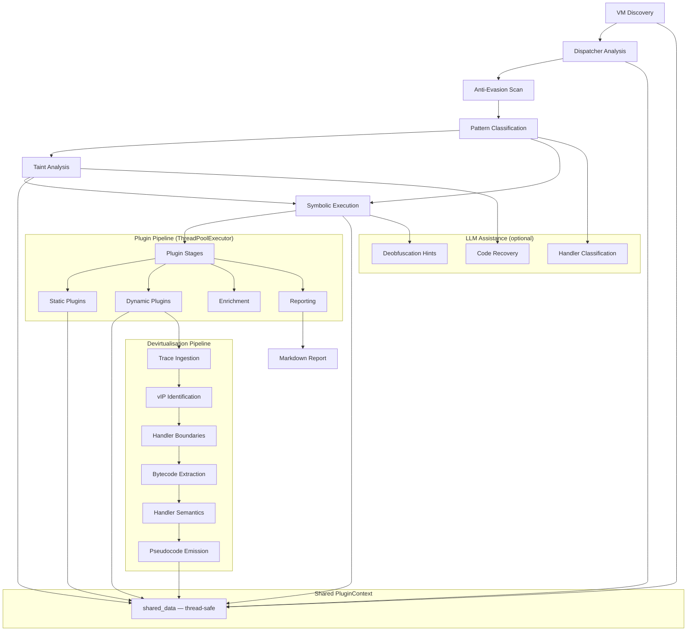

# VMDragonSlayer
**Project will be public by mid-October Refactoring In Progress**

**Advanced Virtual Machine Detection and Analysis Framework**

VMDragonSlayer is a comprehensive framework for analyzing binaries protected by Virtual Machine (VM) based protectors such as VMProtect 2.x/3.x, Themida, and custom malware VMs. The framework combines multiple analysis engines including Dynamic Taint Tracking (DTT), Symbolic Execution (SE), Pattern Classification, and Machine Learning to automate the reverse engineering process.

> **Goal**: Transform complex protected binary analysis from weeks/months of manual work into structured, automated analysis with explainable results.

## Key Features

- **Multi-Engine Analysis**: Combines static, dynamic, and hybrid analysis techniques
- **VM Detection**: Automated detection of commercial and custom VM protectors  
- **Plugin Ecosystem**: Integrations with Ghidra, IDA Pro, and Binary Ninja
- **Machine Learning**: Proof-of-concept ML models for pattern classification
- **Extensible Architecture**: Modular design for custom analysis workflows
- **Research Framework**: Built for malware research and reverse engineering education

---
## Core Capabilities
| Domain | Engine / Module | Highlights |
|--------|-----------------|-----------|
| VM Discovery | `analysis.vm_discovery` | Dispatcher & handler table identification, signature database matching, nested VM heuristics |
| Dispatcher Analysis | `analysis.vm_discovery.dispatcher` | Jump-table scanning, push/ret trampoline detection, handler table reconstruction, opcode→address mapping |
| Pattern Analysis | `analysis.pattern_analysis` | Rule-based + similarity + ML (hybrid auto-selection), regex entry-point matching, optional YARA backend |
| Taint Tracking | `analysis.taint_tracking` | Register + memory taint propagation, virtual register mapping (VMProtect/Themida presets), handler boundary detection |
| Symbolic Execution | `analysis.symbolic_execution.executor` | Real instruction semantics (mov/add/xor/push/pop/lea/cmp/jcc…), z3 branch constraints, opaque predicate detection |
| Anti-Evasion | `analysis.anti_evasion` | Section-aware instruction scanning (PE/ELF), anti-debug/VM/sandbox detection, binary patching |
| Binary Parsing | `analysis.binary_format` | Shared LIEF-based PE/ELF parser used across all analysis modules |
| Trace Ingestion | `analysis.trace_ingestion` | Unified `ExecutionTrace` model; ingestion from text files, angr, Triton, Qiling, and shared plugin data |
| Handler Boundaries | `analysis.vm_discovery.handler_boundaries` | vIP register identification (monotonic + alignment scoring), trace segmentation into per-handler slices |
| CFG Reconstruction | `analysis.cfg` | Instruction-level and handler-level CFGs via networkx, basic-block extraction, dominator analysis |
| Bytecode Extraction | `analysis.bytecode_extract` | Correlates memory reads with handler boundaries to extract the VM bytecode stream |
| Handler Semantics | `analysis.handler_semantics` | Mnemonic histogram analysis → VMOperation classification (add, xor, load, store, jcc, …), opcode table construction |
| Pseudocode Emission | `analysis.pseudocode` | Linear listing, structured (if/while/goto), and C-like function output from devirtualised VM programs |
| Devirtualise Stage | `core.pipeline` (devirtualize) | End-to-end pipeline stage: trace → vIP → boundaries → semantics → pseudocode |
| LLM-Assisted | `llm.analyzer` | Few-shot handler classification, deobfuscation hints, code recovery, pattern explanation (via litellm) |
| ML Pipeline | `ml.handler_classifier` | scikit-learn handler classifier with heuristic fallback; `VMClassifier`, `EnsembleClassifier` |
| Plugin Pipeline | `core.pipeline` | Multi-stage pipeline with ThreadPoolExecutor, per-plugin timeout, thread-safe shared data |
| Plugin Ecosystem | `plugins/` | 16 plugins across 4 stages (static/dynamic/enrichment/reporting) with angr, Triton, Qiling, etc. |
| CLI | `dragonslayer.cli` | `vmdragonslayer analyze`, `serve`, `info` — Click-based command-line interface |
| Reporting | `plugins.reporting.reporter` | VM deobfuscation analysis sections (handler table, taint flow, symbolic results, virtual register map) |

---
## Architecture Overview

VMDragonSlayer uses a modular pipeline architecture where analysis stages flow through a shared context:


```mermaid
graph TD
    A[VM Discovery] --> B[Dispatcher Analysis]
    B --> C[Anti-Evasion Scan]
    C --> D[Pattern Classification]
    D --> E[Taint Analysis]
    D --> F[Symbolic Execution]
    E --> F
    F --> G[Plugin Stages]
    
    subgraph PluginPipeline ["Plugin Pipeline (ThreadPoolExecutor)"]
        G --> G1[Static Plugins]
        G --> G2[Dynamic Plugins]
        G --> G3[Enrichment]
        G --> G4[Reporting]
    end
    
    subgraph DevirtPipeline ["Devirtualisation Pipeline"]
        T1[Trace Ingestion] --> T2[vIP Identification]
        T2 --> T3[Handler Boundaries]
        T3 --> T4[Bytecode Extraction]
        T4 --> T5[Handler Semantics]
        T5 --> T6[Pseudocode Emission]
    end
    
    subgraph SharedContext ["Shared PluginContext"]
        H[shared_data — thread-safe]
    end
    
    A --> H
    B --> H
    E --> H
    F --> H
    G1 --> H
    G2 --> H
    G2 --> T1
    T6 --> H
    G4 --> I[Markdown Report]
    
    subgraph LLM ["LLM Assistance (optional)"]
        J[Handler Classification]
        K[Deobfuscation Hints]
        L[Code Recovery]
    end
    
    D --> J
    F --> K
    E --> L
```

### Core Analysis Engines

#### 1. **VM Discovery Engine** (`dragonslayer.analysis.vm_discovery`)
- **Purpose**: Detect and classify VM-based protection schemes
- **Techniques**: Dispatcher loop detection, handler table analysis, signature database matching
- **Targets**: VMProtect, Themida, custom malware VMs

#### 2. **Dispatcher Analyzer** (`dragonslayer.analysis.vm_discovery.dispatcher`)
- **Purpose**: Identify VM dispatchers and reconstruct handler tables
- **Techniques**: Jump-table scanning (`jmp [reg*4+disp32]`), opcode→address mapping
- **Output**: DispatchTableResult with HandlerEntry list

#### 3. **Dynamic Taint Tracking** (`dragonslayer.analysis.taint_tracking`)
- **Purpose**: Track data flow through VM execution to identify critical paths
- **Implementation**: Register + memory taint propagation with 7 taint tag categories
- **VM-Aware**: Virtual register mapping presets (VMProtect x64/x86, Themida x64), handler boundary detection via untaint/retaint patterns
- **Pipeline**: Uses VMTaintTracker when VM detected, falls back to generic TaintAnalyzer

#### 3. **Pattern Analysis** (`dragonslayer.analysis.pattern_analysis`)
- **Purpose**: Classify and categorize VM patterns and behaviors
- **Methods**: Rule-based matching, similarity analysis, ML classification
- **Database**: Extensible pattern database with JSON schemas

#### 4. **Symbolic Execution** (`dragonslayer.analysis.symbolic_execution`)
- **Purpose**: Explore VM execution paths symbolically
- **Instruction Semantics**: mov, add/sub, and/or/xor, shl/shr/sar/rol/ror, push/pop, lea, cmp/test, inc/dec, neg/not, xchg, movzx/movsx — all produce z3 BitVec expressions
- **Branch Analysis**: Maps jcc mnemonics to z3 constraints, forks state on conditional branches
- **Opaque Predicate Detection**: Trivial (`cmp reg,reg`) + z3-proven constant predicates
- **Integration**: Uses dispatcher addresses from vm_discovery for focused exploration

#### 5. **Anti-Evasion** (`dragonslayer.analysis.anti_evasion`)
- **Purpose**: Detect and neutralise anti-analysis techniques
- **Section-Aware**: Parses PE/ELF section headers to restrict instruction scanning to executable sections (avoids false positives in data sections)
- **Detection**: Anti-debug APIs, timing checks (rdtsc), PEB access, VM/sandbox artefacts, anti-disassembly tricks, self-modifying code
- **Patching**: Generates NOP patches for patchable indicators (int3 excluded as non-patchable)
- **Tuning**: Per-pattern confidence overrides via `_ANTI_DISASM_CONFIDENCE`; reduced `call_next` false positives

#### 6. **Machine Learning Pipeline** (`dragonslayer.ml`)
- **Purpose**: Automated classification and analysis assistance
- **Models**: Basic proof-of-concept models for research and education
- **Components**: `VMClassifier` (high-level entry point), `FeatureExtractor`/`FeatureVector`, `ModelTrainer` with metric collection, `EnsembleClassifier` with majority-vote and weighted strategies
- **Architecture**: Abstract `BaseModel` / `VMHandlerModel` base with `train()`/`predict()`/`save()`/`load()` contract

#### 7. **GPU Acceleration** (`dragonslayer.gpu`)
- **Purpose**: Optional GPU-accelerated analysis when CUDA hardware is available
- **Components**: `GPUEngine` (device management), `GPUMemoryManager` (allocation tracking), `GPUOptimizer` (block-size tuning), `GPUProfiler` (wall-clock timing — works without GPU hardware)
- **Detection**: Runtime `gpu_available()` with guarded torch/CUDA imports; graceful CPU fallback

## Repository Structure

```
VMDragonSlayer/
├── dragonslayer/                    # Main Python package
│   ├── analysis/                   # Analysis engines
│   │   ├── vm_discovery/          # VM detection, dispatcher analysis, handler boundaries
│   │   ├── pattern_analysis/      # Pattern matching, ML classification, YARA backend
│   │   ├── symbolic_execution/    # Symbolic execution with real semantics
│   │   ├── taint_tracking/        # Register + memory taint, VM-aware tracker
│   │   ├── anti_evasion/          # Section-aware anti-analysis detection
│   │   ├── binary_format.py       # Shared LIEF binary parser
│   │   ├── trace_ingestion.py     # Unified execution trace model
│   │   ├── cfg.py                 # CFG reconstruction (instruction + handler level)
│   │   ├── bytecode_extract.py    # VM bytecode stream extraction
│   │   ├── handler_semantics.py   # Handler-to-VMOperation classification
│   │   └── pseudocode.py          # Pseudocode emission (linear/structured/C-like)
│   ├── api/                       # REST API server and client
│   ├── cli.py                     # Click CLI: analyze, serve, info
│   ├── core/                      # Pipeline, orchestrator, config
│   ├── llm/                       # LLM-assisted analysis (litellm)
│   ├── ml/                        # Machine learning pipeline + handler classifier
│   ├── gpu/                       # GPU acceleration support
│   ├── plugins/                   # 16 plugins (static/dynamic/enrichment/reporting)
│   └── utils/                     # Utility functions
├── config/                        # YAML configuration
├── data/                          # Patterns, models, schemas
│   ├── patterns/                  # VMProtect/Themida pattern databases
│   ├── models/                    # ML models and metadata
│   ├── samples/                   # Sample files and traces
│   └── schemas/                   # JSON schemas for validation
├── plugins/                       # External RE tool plugins
│   ├── ghidra/                   # Ghidra plugin (Java/Gradle)
│   ├── idapro/                   # IDA Pro plugin (Python)
│   └── binaryninja/              # Binary Ninja plugin (Python)
├── tests/                         # 335 tests (327 pass, 8 skip)
├── documentation/                 # Documentation
└── LICENSE                        # GPL v3 License
```

## Plugin Ecosystem

VMDragonSlayer integrates with major reverse engineering tools:

### Ghidra Plugin
- **Language**: Java with Gradle build system
- **Features**: VM analysis UI, pattern visualization, automated analysis workflows
- **Status**: Framework implemented, UI components in development

### IDA Pro Plugin  
- **Language**: Python
- **Features**: Seamless integration with IDA's analysis engine
- **Status**: Core functionality available

### Binary Ninja Plugin
- **Language**: Python
- **Features**: Native Binary Ninja API integration
- **Status**: Basic integration implemented

## Machine Learning Components

**Note**: The included ML models are basic proof-of-concept implementations designed for research and educational purposes.

---
## Installation

### Prerequisites
- Python 3.10 or higher (tested with 3.14)
- One or more reverse engineering tools (optional):
  - Ghidra 10.0+ (for Ghidra plugin)
  - IDA Pro 7.0+ (for IDA plugin) 
  - Binary Ninja (for Binary Ninja plugin)

## Hardware Requirements

### Minimum Requirements
- **CPU**: Modern x64 processor
- **RAM**: 8GB minimum, 16GB recommended
- **Storage**: 5GB free space
- **OS**: Windows 10/11, Linux (Ubuntu 20.04+), macOS 11+

### GPU Requirements (Optional but Recommended)
- **NVIDIA GPU**: GTX 1060 or newer for optimal performance
- **CUDA**: Version 11.8 or 12.1+ (installed automatically with PyTorch)
- **VRAM**: 4GB minimum for ML models

### Important Limitations
- **Virtual Machines**: GPU-accelerated features require direct hardware access and may not work in VMs
- **WSL**: Some GPU features may have limited functionality in WSL environments
- **Remote Servers**: Ensure CUDA drivers are properly installed for headless GPU access

## Current Status

### Test Suite
- **335 tests** across 20+ test files
- **327 passed**, 8 skipped (1 z3-solver, 7 yara-python optional)
- All Phase 7 commits verified green before merge
- Coverage: config, exceptions, orchestrator, pattern database, pattern recognizer, plugins, pipeline, analysis modules, CLI, trace ingestion, handler boundaries, CFG, bytecode extraction, handler semantics, pseudocode, handler classifier, pipeline devirt

### What's Implemented and Working

```python
# CLI — the fastest way to run an analysis
# vmdragonslayer analyze binary.exe --type vmprotect_devirt

# Pipeline-based analysis (recommended)
from dragonslayer.core.pipeline import create_vmprotect_devirt_pipeline

pipe, cfg = create_vmprotect_devirt_pipeline()
result = pipe.run(binary_data=open("binary.exe", "rb").read(), pipeline_config=cfg)
# Result includes: vm_discovery, dispatcher_analysis, anti_evasion,
# taint_analysis, symbolic_execution, pattern classification, plugin stages,
# **devirtualize** (pseudocode, opcode table, handler boundaries)

# Devirtualisation pipeline (trace → pseudocode)
from dragonslayer.analysis.trace_ingestion import from_shared_data
from dragonslayer.analysis.vm_discovery.handler_boundaries import identify_vip_register, segment_trace
from dragonslayer.analysis.handler_semantics import analyse_handler_semantics
from dragonslayer.analysis.pseudocode import emit_pseudocode

trace = from_shared_data(shared_data)           # Ingest execution trace
lifted = trace.to_lifted_instructions()          # Re-lift via capstone
vip = identify_vip_register(lifted, dispatchers) # Find virtual IP register
seg = segment_trace(lifted, vip, dispatchers)    # Slice into handlers
table = analyse_handler_semantics(lifted, seg.boundaries)
pseudo = emit_pseudocode(table, seg.boundaries, style="c_like")
print(pseudo.text)

# Orchestrator-based analysis
from dragonslayer.core.orchestrator import Orchestrator, AnalysisType

orchestrator = Orchestrator()
result = orchestrator.analyze_binary(
    open("binary.exe", "rb").read(),
    analysis_type=AnalysisType.VM_DISCOVERY,
)
```
### Quick Start

```bash
# 1. Install with all dependencies
pip install -r requirements.txt
pip install -e .

```

### Core Framework
```bash
# Clone repository
git clone https://github.com/poppopjmp/VMDragonSlayer.git
cd VMDragonSlayer

# UPDATED INSTALLATION
# Install all required dependencies including z3-solver
pip install -r requirements.txt

# Install framework in development mode
pip install -e .

```

### Installation for Different Hardware
```bash
# CPU-only installation (basic functionality)
pip install -r requirements.txt
pip install -e .

# NVIDIA GPU with CUDA 12.x (RTX 30xx/40xx series) 
pip install -r requirements.txt
pip install torch torchvision torchaudio --index-url https://download.pytorch.org/whl/cu121
pip install -e .

# NVIDIA GPU with CUDA 11.8 (older GPUs)
pip install -r requirements.txt  
pip install torch torchvision torchaudio --index-url https://download.pytorch.org/whl/cu118
pip install -e .
```

# Create virtual environment
python -m venv venv
source venv/bin/activate  # Linux/macOS
# or
venv\Scripts\activate     # Windows

# Install dependencies
pip install -r requirements.txt

# Install framework
cd dragonslayer
pip install -e .

### Plugin Installation
Choose your preferred disassembler:

#### Ghidra Plugin
```bash
cd plugins/ghidra
./build.bat  # Windows
# or
./build.sh   # Linux/macOS

# Install to Ghidra
cp dist/VMDragonSlayer.zip $GHIDRA_INSTALL_DIR/Extensions/
```

---
## Quick Start

### 1. Basic Framework Usage
```python
from dragonslayer.core.orchestrator import Orchestrator, AnalysisType

# Initialize orchestrator (loads default configuration automatically)
orchestrator = Orchestrator()

# Analyze a binary
result = orchestrator.analyze_binary("path/to/protected_binary.exe", analysis_type=AnalysisType.VM_DISCOVERY)

# Extract VM discovery results
vmd = result.get("vm_discovery", {})
print(f"VM Protection Detected: {vmd.get('vm_detected', False)}")
print(f"Handler Count: {len(vmd.get('handlers_found', []))}")
print(f"Analysis Success: {result.get('success', False)}")
```

## Plugin Status

### Reverse Engineering Tool Integrations

| Tool | Status | ETA | Notes |
|------|---------|-----|-------|
| **Direct API** | Stable | Available Now | Recommended approach |
| **Ghidra Plugin** | In Progress | October 2025 | Basic functionality available |
| **IDA Pro Plugin** | Under Development | November 2025 | Work in progress - not functional |
| **Binary Ninja Plugin** | Under Development | November 2025 | Work in progress - not functional |

---
## Architecture

VMDragonSlayer uses a modular architecture with multiple analysis engines:

### Analysis Engines

#### VM Discovery Engine
- **Dispatcher Detection**: Identifies VM dispatcher loops using control flow analysis
- **Handler Mapping**: Maps VM handlers and their relationships  
- **Architecture Recognition**: Detects VMProtect, Themida, and custom VM architectures

#### Taint Tracking Engine  
- **Dynamic Analysis**: Tracks data flow through VM handlers
- **Precision Control**: Byte-level or instruction-level granularity
- **Anti-Evasion**: Bypasses common analysis detection techniques

#### Pattern Analysis Engine
- **Signature Matching**: Rule-based pattern recognition
- **ML Classification**: Machine learning-based handler classification
- **Similarity Analysis**: Fuzzy matching for variant detection

#### Symbolic Execution Engine
- **Path Exploration**: Systematic exploration of execution paths
- **Constraint Solving**: Z3-based constraint resolution
- **VM-Aware Analysis**: Specialized handling for virtualized code

### Machine Learning Models

The framework includes several proof-of-concept models:

#### Available Models
- **Bytecode Classifier**: Pattern recognition in VM bytecode sequences
- **VM Detector**: Binary classification for VM protection presence  
- **Handler Classifier**: Classification of VM handler types
- **VMProtect Detector**: Specialized detector for VMProtect patterns
- **Ensemble Model**: Combines multiple classifiers for improved accuracy

#### Model Characteristics
- **Format**: Scikit-learn compatible (joblib serialization)
- **Size**: Small models suitable for rapid prototyping
- **Purpose**: Educational examples and research baselines
- **Training Data**: Synthetic and limited real-world samples

### Thread Safety & Robustness
- **Config singleton** — Double-checked locking with `threading.Lock`
- **Storage backends** — `MemoryBackend` and `LocalFileBackend` guarded with locks; batch flush for bulk writes
- **Plugin shared_data** — Thread-safe accessors via `PluginContext`
- **API rate limiter** — `asyncio.Lock`-protected async rate limit handler
- **Taint state** — `TaintTracker.reset()` ensures clean state between runs


---
## Configuration

### Environment Variables
```bash
# Core configuration
export VMDS_CONFIG_PATH="/path/to/config"
export VMDS_MODEL_PATH="/path/to/models"  
export VMDS_LOG_LEVEL="INFO"

# Database configuration
export VMDS_DB_URL="sqlite:///vmds.db"

# API configuration
export VMDS_API_HOST="localhost"
export VMDS_API_PORT="8000"
```

### Configuration Files
- `config/vmdragonslayer.yml`: Main configuration (analysis, API, logging, paths)
- `config/analysis_profiles.json`: Pipeline profile definitions
- `data/patterns/vmprotect_handlers.json`: VMProtect handler signatures
- `data/patterns/themida_patterns.json`: Themida pattern database
- `data/schemas/analysis_result_schema.json`: JSON schema for analysis output

---
## Examples

### Advanced Configuration
```python
from dragonslayer.core.config import Config
from dragonslayer.analysis.taint_tracking import VMTaintTracker, VM_REG_PRESETS
from dragonslayer.analysis.symbolic_execution.executor import SymbolicExecutor
from dragonslayer.analysis.anti_evasion.environment_normalizer import EnvironmentNormalizer

# VM-aware taint analysis with virtual register mapping
vtt = VMTaintTracker()
result = vtt.analyze_vm_trace(
    instructions=lifted_instructions,
    vm_preset="vmprotect_x64",  # maps rsi→vIP, rbp→vSP, rdi→vContext, r12→vHandlerTbl
)
print(result["virtual_register_map"])
print(result["handler_boundaries"])

# Symbolic execution with real instruction semantics
executor = SymbolicExecutor()
sym_result = executor.analyze(binary_data, entry_point=0x401000)
print(f"Paths explored: {sym_result.paths_explored}")
print(f"Opaque predicates: {sym_result.opaque_predicates}")

# Section-aware anti-evasion (only scans executable sections)
normalizer = EnvironmentNormalizer()
report = normalizer.analyze(binary_data)
patched = normalizer.apply_patches(binary_data, report.patches)
```

### Batch Analysis
```python
from dragonslayer.workflows.manager import WorkflowManager

# Process multiple binaries
manager = WorkflowManager()
results = manager.process_batch([
    "sample1.exe",
    "sample2.exe", 
    "sample3.exe"
])

# Generate summary report
manager.generate_report(results, "analysis_report.json")
```

---
## Contributing

We welcome contributions! Please see:
- [CONTRIBUTING.md](CONTRIBUTING.md) - Development guidelines
- [CODE_OF_CONDUCT.md](CODE_OF_CONDUCT.md) - Community standards
- [SECURITY.md](SECURITY.md) - Security policy

---
## License

This project is licensed under the GNU General Public License v3.0. See [LICENSE](LICENSE) for details.

---
## Citation

If you use VMDragonSlayer in your research, please cite:

```bibtex
@software{vmdragonslayer_2025,
  title   = {VMDragonSlayer: Automated VM-based Binary Protection Analysis},
  author  = {Panico, Agostino},
  year    = {2025},
  url     = {https://github.com/poppopjmp/VMDragonSlayer}
}
```

---
## Contact

- **Author**: van1sh
- **Email**: van1sh@securitybsides.it
- **GitHub**: [@poppopjmp](https://github.com/poppopjmp)

---
## Acknowledgments

Special thanks to the reverse engineering community and the developers of the underlying analysis tools and libraries that make this framework possible.

