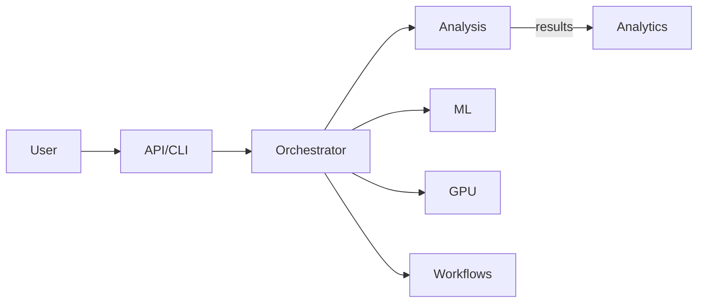

# VMDragonSlayer

Advanced Virtual Machine Detection and Analysis Framework.

- Key capabilities: VM discovery, pattern analysis, taint tracking, symbolic execution, ML-assisted classification, GPU acceleration, analytics UI.
- Primary packages: `core`, `api`, `analysis`, `ml`, `gpu`, `ui`, `utils`, `workflows`, `enterprise`.
- Orchestrated design: requests go through a unified API and orchestrator to the analysis engines and back to the client/UI.

See `Home.md` for the full index and quick navigation to all sections.
