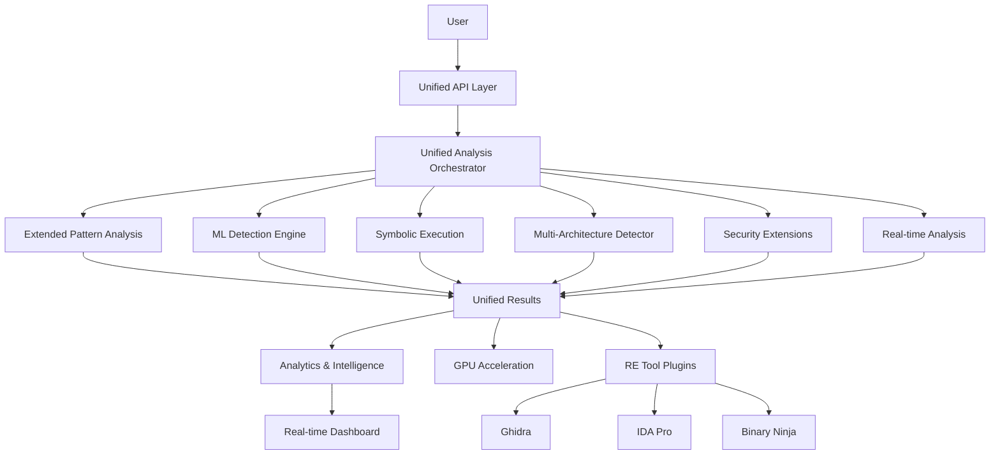

# VMDragonSlayer

Advanced Virtual Machine Detection and Analysis Framework with Extended Intelligence Capabilities.

## Core Capabilities

- **VM Discovery**: Advanced structural VM detection and analysis
- **Extended Pattern Analysis**: Metamorphic and polymorphic VM pattern recognition
- **Multi-Architecture Support**: Cross-platform detection for x86, x64, ARM, MIPS, and more
- **ML-Enhanced Detection**: Ensemble machine learning with adversarial resistance
- **Symbolic Execution**: SMT-based path exploration and constraint solving
- **Real-time Analysis**: Streaming analysis with live monitoring and WebSocket updates
- **Security Extensions**: Anti-evasion countermeasures and stealth analysis
- **Dynamic Taint Tracking**: Advanced dataflow analysis with Pin/Triton integration
- **GPU Acceleration**: High-performance computing for large-scale analysis
- **Unified Integration**: Orchestrated analysis combining all engines seamlessly

## Architecture Components

- **Core**: `core`, `api`, `unified_analysis` - Unified orchestration layer
- **Analysis Engines**: `analysis` - Extended pattern matching, symbolic execution, multi-arch support, security extensions
- **Intelligence**: `ml`, `analytics` - Machine learning detection and threat intelligence
- **Performance**: `gpu`, `realtime` - GPU acceleration and streaming analysis
- **Integration**: `ui`, `workflows`, `enterprise` - User interfaces and enterprise features
- **Platform Support**: `plugins` - Ghidra, IDA Pro, Binary Ninja integration

## Enhanced Analysis Flow

The framework operates through a **unified analysis orchestrator** that intelligently coordinates multiple detection engines, providing confidence-based results with comprehensive VM analysis capabilities.

See `Home.md` for the full index and quick navigation to all sections.
